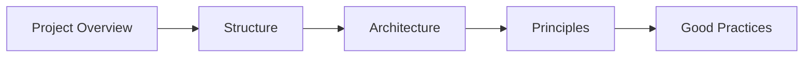

# Xseed Developer Metrics CLI — Documentation

This folder contains project documentation: structure, architecture, principles, and good practices.

## Documentation Index

| Document | Description |
|----------|-------------|
| [Project Overview](project-overview.md) | What the project is, goals, audience, and scope |
| [Project Structure](structure.md) | Directory layout, modules, and file organization |
| [Architecture](architecture.md) | High-level design, layers, data flow, and integrations |
| [Principles](principles.md) | Design principles (SPACE, DevEx) and philosophy |
| [Good Practices](good-practices.md) | Coding standards, conventions, and patterns to follow |

## Quick Links

- **Getting started**: See the root [README.md](../README.md) for installation and usage.
- **Configuration**: `~/.xseed-metrics/config.json` and environment variables (see [Project Overview](project-overview.md#configuration)).
- **Contributing**: Follow [Good Practices](good-practices.md) when adding or changing code.
