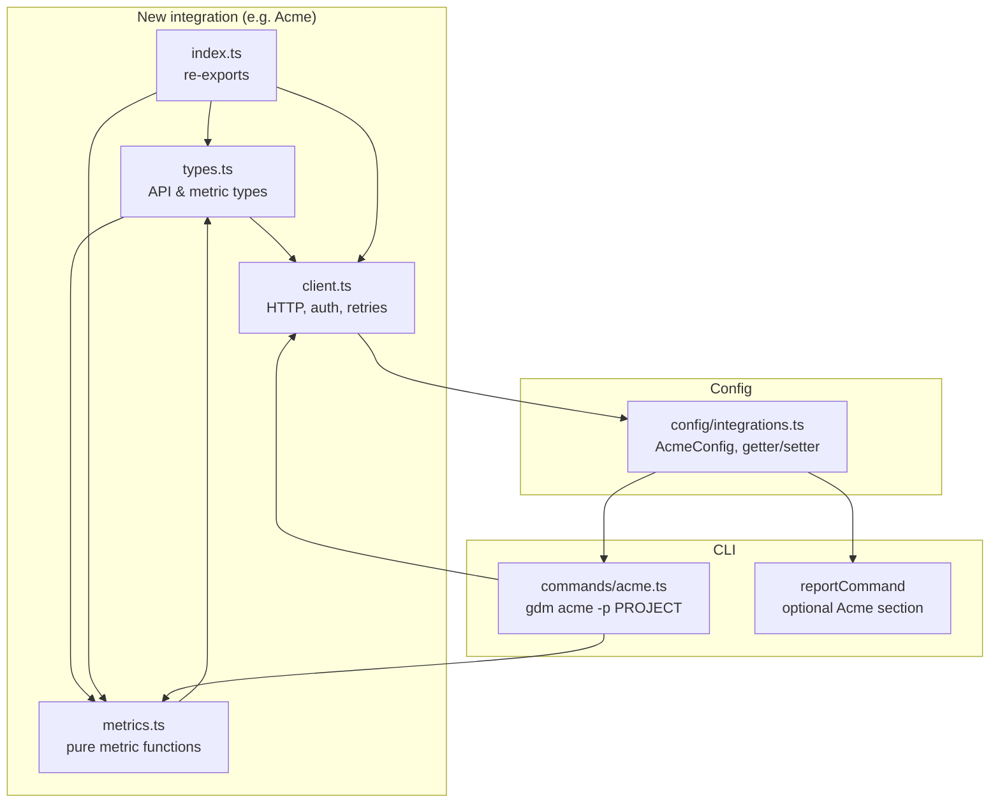

# Architecture

## High-Level Design

The CLI is organized in **layers**: entry point → commands → core/config/integrations → output. There is no database; state lives in the file system (config + data directory).

## Layers

### 1. Entry (CLI)

- **Responsibility**: Parse argv, register commands, show banner or help, invoke the right command handler.
- **Location**: `src/index.ts`.
- **Pattern**: One Commander `program`; commands get options and arguments and call async handlers from `commands/`. No business logic here.

### 2. Commands

- **Responsibility**: Orchestrate config, core, integrations, and output; handle errors and user feedback (spinners, chalk messages).
- **Location**: `src/commands/*.ts`.
- **Pattern**: Command receives parsed options; uses `GitMetrics`, `getConfig`/getters, integration clients; calls formatters; writes to stdout or file. Use `ora` for progress and `chalk` for success/error.

### 3. Config

- **Responsibility**: Read/merge config from file and env; expose paths and status; persist updates.
- **Location**: `src/config/integrations.ts`.
- **Pattern**: File config at `~/.xseed-metrics/config.json`; env overrides for Git/Jira/Linear; getters (`getJiraConfig`, etc.) and setters (`saveConfig`, `markInitialized`, etc.). No CLI or formatting here.

### 4. Core (Domain)

- **Responsibility**: Git-only metrics: summary, authors, commits, time stats, file stats, blame, period stats, file types.
- **Location**: `src/core/git-metrics.ts`, `src/types.ts`.
- **Pattern**: `GitMetrics` class per repo path; uses `FilterOptions`; runs `git` via `execSync`; returns typed structures. No I/O beyond git and no knowledge of Jira/Linear.

### 5. Integrations

- **Responsibility**: Talk to external APIs (Jira, Linear); fetch issues/sprints; compute integration-specific metrics (cycle time, lead time, WIP, throughput).
- **Location**: `src/integrations/jira/`, `src/integrations/linear/`.
- **Pattern**: Per integration: **client** (HTTP, auth, retries), **metrics** (pure functions from raw API data to metric DTOs), **types** (API and metric types), **index** (re-exports). Config (URL, keys) comes from `config/integrations`, not from CLI options only.

### 6. Output

- **Responsibility**: Turn data structures into table, JSON, CSV, or markdown strings.
- **Location**: `src/output/formatters.ts`.
- **Pattern**: Formatter functions take data + format; return string. No side effects (no direct file write); commands do file write when `--output` is set.

## Data Flow

### One-off Git analysis (e.g. `gdm authors`)

1. User runs `gdm authors [path]`.
2. `index.ts` parses and calls `authorsCommand(path, options)`.
3. Command builds `FilterOptions`, instantiates `GitMetrics(path)`, calls `getAuthorStats(filterOptions)`.
4. `GitMetrics` runs `git log` (and related) commands, parses output, returns `AuthorStats[]`.
5. Command calls `formatAuthorStats(stats, options.format)`.
6. Result is printed or written to file by the command.

### Collect (persisted metrics)

1. User runs `gdm collect` (or daemon runs it).
2. Command reads repos and Git config from `getConfig()`; optionally pulls (git), then uses `GitMetrics` per repo; optionally fetches Jira/Linear via integration clients.
3. Aggregated payload (e.g. summary, userStats, activity, trends, optional Jira) is written to `getDataDir()` as JSON (e.g. `repo-name_YYYY-MM-DD.json`).
4. Config can be updated (e.g. `lastRun`).

### Daemon (scheduler)

1. `gdm daemon start`: ensure config has scheduler enabled, then install a cron job that runs `gdm collect --all --quiet` at the configured interval (e.g. weekly Monday 9am).
2. Cron runs in the user’s environment; stdout/stderr are appended to daemon log.
3. `gdm daemon status/logs/stop` read PID file, crontab, or log file and report or remove cron.

## Integration Pattern

To add a new integration (e.g. “Acme” issue tracker):

1. **Types**: In `src/integrations/acme/types.ts`, define API and metric types.
2. **Client**: In `src/integrations/acme/client.ts`, implement an API client (auth, request/retry, methods to fetch issues/sprints). Use config from `config/integrations` (add `AcmeConfig` and getter/setter if needed).
3. **Metrics**: In `src/integrations/acme/metrics.ts`, implement pure functions that map API responses to metric objects (cycle time, throughput, etc.).
4. **Config**: Extend `IntegrationConfig` and config file shape; add env vars and getter/setter in `config/integrations.ts`; optionally extend `init` wizard.
5. **Command**: Add `src/commands/acme.ts` and register in `index.ts` (e.g. `gdm acme -p PROJECT`).
6. **Report**: Optionally plug into `reportCommand` in `commands/index.ts` to include Acme metrics in the full report.

Keep **network and I/O in the client**, **pure metric computation in metrics**, and **CLI flow in commands**.

## Error Handling

- **Core**: `GitMetrics` throws on invalid repo or git errors; commands catch and display a message, then `process.exit(1)`.
- **Integrations**: Clients may throw or return `{ success: false, error }`; commands or report logic should handle both and show a clear message (e.g. “Jira: not configured” or “Connection failed: …”).
- **Config**: Missing or invalid config is handled by getters (return null or default) and by commands that check `isInitialized()` or integration config before running.

## Concurrency

- No shared in-memory state between commands; each run is independent.
- Daemon does not keep a long-running process; it relies on cron to spawn `gdm collect` periodically. So no concurrency between daemon and collect beyond the OS scheduler.

## Security and Secrets

- **Config file**: Stored under user home; contains tokens and API keys. Should have restrictive permissions (e.g. 0600) if implemented.
- **Environment variables**: Preferred in CI; env overrides file so that secrets are not written to disk.
- **No secrets in logs**: Avoid logging tokens or full API responses; log only success/failure and minimal identifiers.

This architecture keeps the CLI simple, testable, and easy to extend with new commands or integrations.
