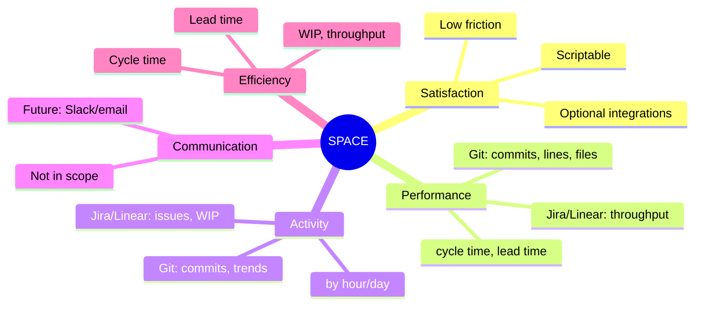

# Principles

## Design Philosophy

The Xseed Developer Metrics CLI is built around a few guiding principles: align with established frameworks for developer productivity, keep the tool simple and scriptable, and respect user privacy and control.

## SPACE Framework Alignment

Metrics and features are chosen to align with the **SPACE** framework for developer productivity:

- **Satisfaction**: Not directly measured by this CLI; the tool avoids adding friction (quick setup, optional integrations, scriptable commands).
- **Performance**: Git metrics (commits, lines, files) and integration metrics (throughput, cycle time, lead time) support outcome-oriented performance views.
- **Activity**: Git activity (commits, trends, activity by hour/day) and optional Jira/Linear activity (issues completed, WIP) give an activity dimension.
- **Communication**: Not the primary focus; the tool does not scrape Slack or email. Future extensions could add communication metrics if needed.
- **Efficiency**: Cycle time, lead time, and flow (WIP, throughput) from Jira/Linear support efficiency and flow efficiency.

**Principle**: Prefer metrics that are **interpretable** and **actionable** (e.g. cycle time, throughput) over vanity metrics. Document what each metric means and how it can be used (see README and docs).

## Developer Experience (DevEx)

- **First run**: `gdm init` guides setup with sensible defaults and optional steps (e.g. skip Jira/Linear).
- **Scriptability**: All commands support non-interactive use: options and env vars for init; `-f json`, `-o file` for output; `--quiet` where applicable.
- **Feedback**: Spinners and clear success/error messages; no silent failures. Use chalk for consistent, readable output.
- **Performance**: Git operations can be slow on large repos; use spinners and consider future options (e.g. limit history, cache) to keep the tool responsive.
- **Consistency**: Common options (`--since`, `--until`, `--format`, `--output`) are shared across Git commands; integration commands follow a similar pattern (`-p`/`-t`, `--since`, `--until`, `-f`, `-o`).

**Principle**: The CLI should be **pleasant for interactive use** and **reliable for scripts and automation** (CI, cron, reporting pipelines).

## Data and Privacy

- **Local-first**: Config and collected data live under `~/.xseed-metrics/`. No telemetry or external reporting by default.
- **Explicit integrations**: Jira and Linear are opt-in; credentials come from user config or env. The tool does not send data to third parties except to the configured Jira/Linear instances.
- **Transparency**: Users can inspect `config.json` and the JSON files in `data/` to see exactly what is stored.
- **Sensitive data**: Tokens and API keys are stored in config or env; avoid logging or displaying them. Prefer env in shared/CI environments.

**Principle**: **User data stays under user control**; no hidden uploads or mandatory cloud services.

## Simplicity and Maintainability

- **Single binary/entry**: One CLI (`gdm` / `xseed-metrics`); no separate daemon process—scheduling is done via cron.
- **Layered architecture**: Clear separation between CLI, commands, core, config, integrations, and output so that changes are localized (see [Architecture](architecture.md)).
- **Consistent integration pattern**: Each external system (Jira, Linear) follows the same structure (client, metrics, types); new integrations follow the same pattern.
- **Minimal dependencies**: Use a small set of well-known dependencies (Commander, chalk, date-fns, etc.); avoid unnecessary abstractions.

**Principle**: **Do one thing well** (metrics collection and reporting); keep the codebase easy to understand and extend.

## Backward Compatibility and Configuration

- **Config versioning**: Config has a `version` field so that future changes can be handled with migrations or clear upgrade paths.
- **Env overrides**: Environment variables override file config so that the same binary works in different environments (local vs CI) without editing config files.
- **Graceful degradation**: If Jira or Linear is not configured, those parts of the report or collect are skipped with a clear message instead of failing the whole run.

**Principle**: **Prefer additive changes** (new options, new commands, new integrations) over breaking changes; when breaking changes are necessary, document them and provide migration guidance.

## What the Project Needs to Follow

- **Documentation**: Keep README and `/docs` in sync with behavior (commands, config, env vars, metrics meaning).
- **Types**: Use TypeScript types and interfaces for all public boundaries (commands, core, integrations, formatters); avoid `any` where a proper type is feasible.
- **Errors**: Fail with clear messages and non-zero exit codes; avoid swallowing errors without logging or user feedback.
- **Testing** (when added): Prefer unit tests for core and metrics logic; integration tests for critical flows (e.g. collect, report) if needed. Mock external APIs and git where appropriate.

These principles should guide new features, refactors, and documentation so the project stays consistent and trustworthy.
