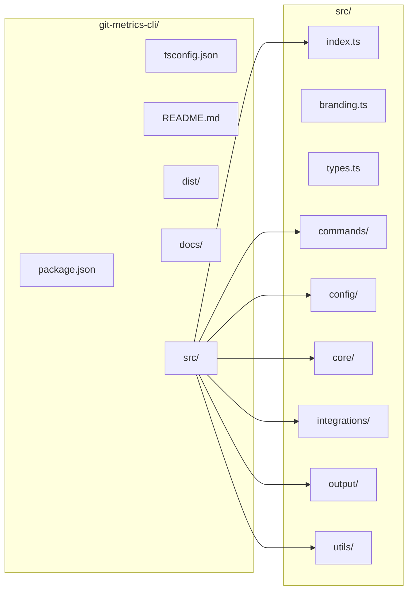

# Project Structure

## Directory Layout

| Path | Purpose |
|------|---------|
| `src/index.ts` | CLI entry point, Commander setup |
| `src/branding.ts` | Logo, banners, print helpers |
| `src/types.ts` | Shared types and interfaces |
| `src/commands/` | CLI command handlers |
| `src/config/` | Configuration management |
| `src/core/` | Core domain logic (Git metrics) |
| `src/integrations/` | External services (Jira, Linear) |
| `src/output/` | Formatting (table, JSON, CSV, markdown) |
| `src/utils/` | Shared utilities (dates, etc.) |
| `dist/` | Compiled output (generated) |
| `docs/` | Project documentation |

## Source Modules

### `src/`

- **`index.ts`** — Entry point. Creates the Commander program, registers all commands, handles banner/help, and runs the selected command or shows default status.
- **`branding.ts`** — Xseed branding: ASCII logo, compact header, and helpers like `printSuccess`, `printError`, `printWarning`, `printSection`.
- **`types.ts`** — Shared TypeScript types: `AuthorStats`, `CommitInfo`, `FileStats`, `TimeStats`, `RepoSummary`, `FilterOptions`, `BlameStats`, `PeriodStats`, `GroupBy`, etc.

### `src/commands/`

CLI command implementations. Each file typically exports one or more command handlers used by `index.ts`.

| File | Purpose |
|------|---------|
| `index.ts` | Git analysis commands: summary, authors, commits, activity, files, trends, blame, report, types. Uses `GitMetrics` and formatters. |
| `init.ts` | Interactive and non-interactive setup wizard; writes config via `config/integrations`. |
| `collect.ts` | Collects metrics from configured repos (git pull, GitMetrics, optional Jira), saves to `~/.xseed-metrics/data/`. |
| `show.ts` | Displays historical collected data from the data directory. |
| `daemon.ts` | Daemon/scheduler: start, stop, status, logs, run. Manages cron for weekly/daily collection. |
| `config.ts` | Integration config: check, init, test connections. |
| `jira.ts` | `gdm jira -p PROJECT` — Jira project metrics. |
| `linear.ts` | `gdm linear -t TEAM` — Linear team metrics. |

### `src/config/`

- **`integrations.ts`** — Single source for app config: read/write `~/.xseed-metrics/config.json`, env overrides, paths (config dir, data dir, logs dir). Exposes `getConfig`, `getJiraConfig`, `getLinearConfig`, `getGitConfig`, `isInitialized`, `getConfigStatus`, `saveConfig`, and specific setters.

### `src/core/`

- **`git-metrics.ts`** — `GitMetrics` class. Wraps `git` CLI calls for a given repo path. Methods: `getRepoSummary`, `getAuthorStats`, `getCommits`, `getTimeStats`, `getFileStats`, `getBlameStats`, `getStatsByPeriod`, `getFileTypeStats`. Uses `FilterOptions` and shared types.

### `src/integrations/`

Each integration lives in its own subfolder with a consistent shape:

- **`jira/`** — `client.ts` (API client), `metrics.ts` (compute cycle/lead time, WIP, throughput, bug ratio), `types.ts` (Jira types), `index.ts` (re-exports).
- **`linear/`** — Same pattern: `client.ts`, `metrics.ts`, `types.ts`, `index.ts`.

New integrations (e.g. another issue tracker) should follow this layout: client, metrics, types, index.

### `src/output/`

- **`formatters.ts`** — Formatting for all Git (and some Jira) outputs: table (cli-table3 + chalk), JSON, CSV, markdown. Functions like `formatRepoSummary`, `formatAuthorStats`, `formatCommits`, `formatTimeStats`, `formatFileStats`, `formatPeriodStats`, `formatBlameStats`, plus generic `formatOutput<T>`.

### `src/utils/`

- **`date-utils.ts`** — Date parsing (ISO and relative e.g. `"2 weeks ago"`), formatting, week/month keys, duration. Used by core and formatters.

## Build Output

- **`dist/`** — Produced by `npm run build` (tsc). Contains `.js`, `.d.ts`, and `.map` files. Entry for the CLI is `dist/index.js` (see `package.json` `bin`).

## File Naming Conventions

- **TypeScript**: `kebab-case.ts` for files (e.g. `date-utils.ts`, `git-metrics.ts`).
- **Commands**: One main file per command or group (e.g. `collect.ts`, `daemon.ts`); Git analysis commands are grouped in `commands/index.ts`.
- **Exports**: Public API per module via `index.ts` in integrations; commands are imported by name in `src/index.ts`.

## Dependencies (High Level)

- **CLI**: Commander.
- **Output**: chalk, cli-table3, ora (spinners).
- **Git**: simple-git not used in core; current implementation uses `child_process.execSync` and raw `git` commands in `core/git-metrics.ts`.
- **Dates**: date-fns.
- **Config/FS**: Node `fs`, `path`, `os` (homedir). No separate config library; JSON read/write in `config/integrations.ts`.

This structure keeps CLI, config, core domain, integrations, and formatting separated so that new commands or integrations can be added without scattering logic.
